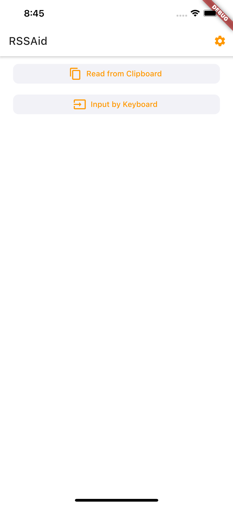
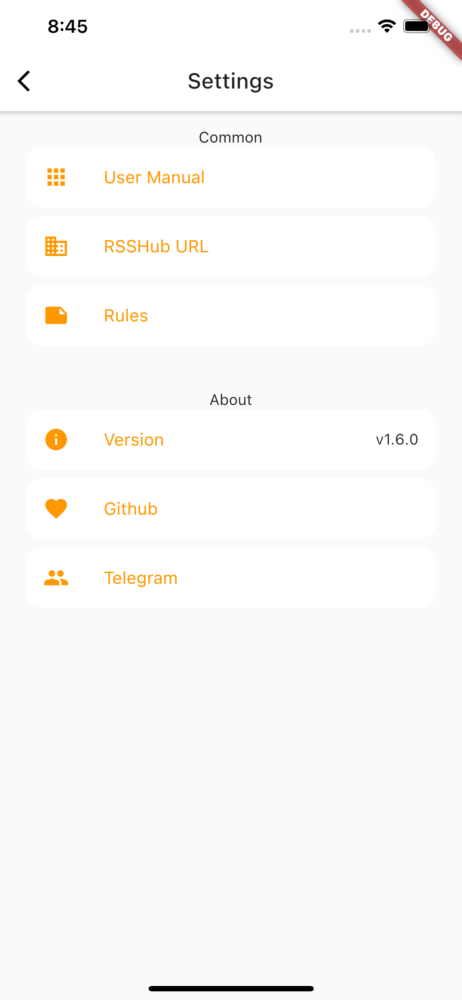

<h1 align=center>RSSAid</h1>

> RSSAid is a complementary app for [RSSHub](https://github.com/DIYgod/RSSHub) built with Flutter, similar to [RSSHub Radar](https://github.com/DIYgod/RSSHub-Radar), which helps you quickly discover and subscribe to RSS feeds from websites, and supports common parameters of RSSHub (for filtering, getting full text, etc.)
> [ChineseVersion](README_CN.md)

## Install

The latest build for Android can be found in [the releases](https://github.com/lt94/RSSAid/releases).

## Build

If you wish to build the application from source, please refer to the [official documentation by Flutter](https://flutter.cn/docs/deployment/android).

## Features

- [x] Detect RSSHub sources from URL (Supports almost all rules as RSSHub Radar)
- [x] Supports mobile-only URLs (auto URL expansion for shortlinks and mobile subdomains)
- [x] Import URLs from clipboard
- [x] Quick subscription
- [x] Customizable general parameters
- [x] Customizable RSSHub server
- [x] Auto-update RSSHub Radar rules
- [x] Supports Weibo
- [x] Supports customized rules
- [x] Save history
- [x] RSS+ rules
- [x] Available on FDroid
- [x] English version

## Rules

RSSAid use the same [rules](https://github.com/DIYgod/RSSHub/blob/master/assets/radar-rules.js) as [RSSHub Radar](https://github.com/DIYgod/RSSHub-Radar) and both supports auto-update.

If you wish to submit new rules for RSSHub Radar and RSSAid, see [how](https://docs.rsshub.app/joinus/#ti-jiao-xin-de-rsshub-radar-gui-ze).

> Note that rules using `document` in `target` is not applicable to RSSAid. RSSAid is NOT a browser extension, it simply gets and parses URL.

> Some pages have different URLs for mobile and PC, but rules on RSSHub Radar only supports PC-style URLs. RSSAid will try to convert mobile-specific URLs, but if you find a URL that is valid on RSSHub Radar but not on RSSAid, try using the URL for PC, and report the issue on Telegram.

## Author

RSSAid is made by Leetao and licensed under **MIT license**.
